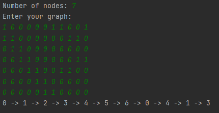
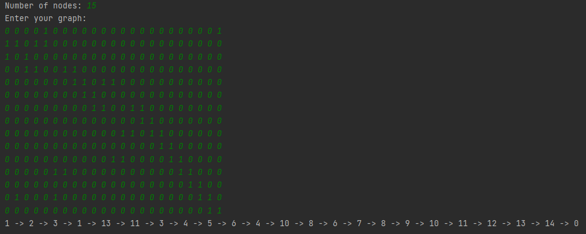
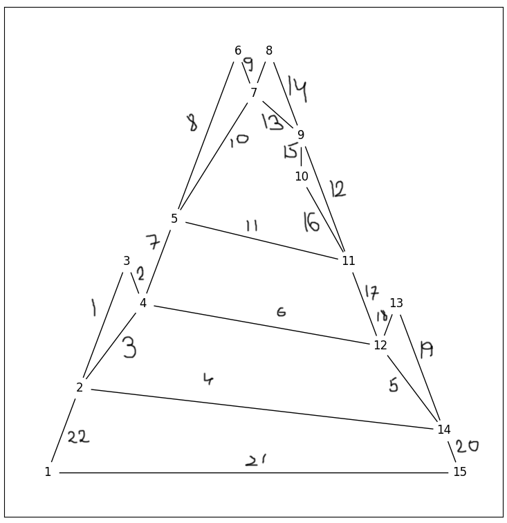

# Лабораторна 3

## Мета роботи

Вивчити основні алгоритми на графах та способи їх імпелементації

## Завдання

Варіант 22: побудова Ейлерового циклу за означенням, граф неорієнтований і заданий матрицею інцидентності

## Виконання

### Псевдокод алгоритму

```
procedure EulerRecurcive(matrix, node, stack)
    for i from 1 to length(matrix[0])
    do
        if matrix[node][i]
        then
            for next_node from 1 to length(matrix)
            do
                Знаходимо вершину, інциденту тому самому ребру, перевіряємо, чи ребро у стекові
                if matrix[next_node][i] and next_node != node and 
                                    not stack.contains((node, next_node)) and not stack.contains((next_node, node))
                then stack.push((node, next_node))
                     EulerRecursive(matrix, next_node, stack)
                     return

procedure FindEulerCycle(matrix)
    Перевірка, чи можна побудувати Ейлерів цикл, знаходимо вершину з найбільшим степенем
    max = 0
    node = 0
    for i from 1 to length(matrix)
    do
        sum = 0
        
        for j from 1 to length(matrix[i])
        do
            sum += matrix[i][j]
        
            if sum mod 2 == 1
            then return False
            
            if sum > max
            then node = i
                 max = s
    
    stack = []
    
    EulerRecursive(matrix, node, stack)
    
    return stack
```

### Програмна реалізація алгоритму

#### Вихідний код

```py
def euler_rec(matrix, node, path):
    """Recursive function to conduct DFS checking if an edge is already in the path"""
    for i in range(len(matrix[0])):
        if matrix[node][i]:
            for next_node in range(len(matrix)):
                # find edge, check if in the path
                if matrix[next_node][i] and next_node != node \
                        and (node, next_node) not in path and (next_node, node) not in path:
                    path.append((node, next_node))
                    euler_rec(matrix, next_node, path)
                    return


def find_euler_cycle(matrix):
    """Find euler path and return a list of nodes you need to go through"""
    # check for having an euler cycle
    m = 0
    node = 0
    for i, line in enumerate(matrix):
        s = sum(line)
        if s % 2 == 1:
            return []
        if s > m:
            node = i
            m = s

    path = []
    # start recursive DFS
    euler_rec(matrix, node, path)
    return path
```

#### Приклад роботи



*Приклад роботи для графу на 7 вершин*



*Приклад роботи для графу на 15 вершин*

### Розв'язання задачі вручну



Розв'язання задачі вручну для графу на 15 вершин (див. приклад роботи)

Обхід здійснено, Ейлерів цикл знайдено, відповідь збігається з результатом роботи алгоритму

## Висновок
Під час виконання даної лабораторної роботи було розроблено алгоритм побудови ейлерового циклу за означенням, 
виконано програмну реалізацію алгоритму на Python, а також протестовано алгоритм, порівнюючи його з розв'язанням 
задачі вручну. У результаті було продемонстровано результат виконання програми, подібний до розв'язання вручну 