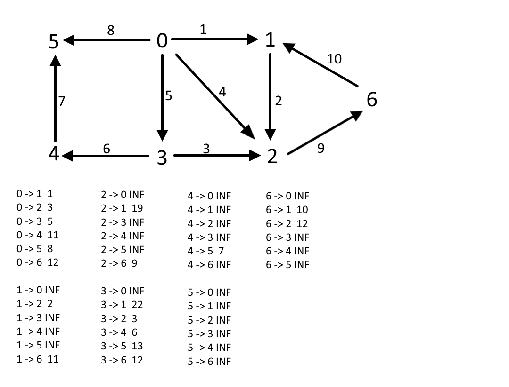

# Лабораторна 4
##Мета роботи
Вивчити додаткові прикладні алгоритми на графах та способи їх імпелементації
##Завдання
Варіант 22: пошук усіх найкоротших шляхів за алгоритмом Флойда-Воршелла (вбудований спосіб визначення шляхів), 
граф заданий матрицею вагів

##Виконання
###Псевдокод алгоритму
```
procedure FloydAlgorithm(matrix)

    Ініціалізуємо next_node
    for i from 1 to length(matrix)
    do 
        for j from 1 to length(matrix)
        do
            next_node[i][j] = -1
    
    Основний алгоритм
    for k from 1 to length(matrix)
    do
        for i from 1 to length(matrix)
        do
            for j from 1 to length(matrix)
            do
                if matrix[i][j] > matrix[i][k] + matrix[k][j]
                then
                    matrix[i][j] = matrix[i][k] + matrix[k][j]
                    next_node[i][j] = k 
   return matrix, next_node

procedure GetPath(i, j, next_nodes, path)
    k = next_nodes[i][j]
    
    if k == -1
    then return
    
    Один бік ходу
    GetPath(i, k, next_nodes, path)
    path.push(k)
    Другий бік ходу
    GetPath(k, j, next_nodes, path)

```
###Програмна реалізація алгоритму
####Вихідний код
```py
def floyd_algorithm(matrix: list) -> (list, list):
    """Conducts floyd algorithm, returns matrix of the smallest paths and matrix of next nodes"""
    next_nodes = [[-1 for _ in range(len(matrix))] for _ in range(len(matrix))]
    for k in range(len(matrix)):
        for i in range(len(matrix)):
            for j in range(len(matrix)):
                if matrix[i][j] > matrix[i][k] + matrix[k][j]:
                    matrix[i][j] = matrix[i][k] + matrix[k][j]
                    next_nodes[i][j] = k
    return matrix, next_nodes


def get_path(i: int, j: int, next_nodes: list, path: list) -> None:
    """Recreate path using next nodes list, adds only nodes inbetween"""
    k = next_nodes[i][j]
    if k == -1:
        return
    get_path(i, k, next_nodes, path)
    path.append(k)
    get_path(k, j, next_nodes, path)
```
####Приклад роботи


*Приклад роботи для графу на 7 вершин*


*Приклад роботи для графу на 15 вершин*

###Розв'язання задачі вручну

Обраний граф для розв'язання вручну, 7 вершин: 
```
[[0, 1, 4, 5, INF, 8, INF],
[INF, 0, 2, INF, INF, INF, INF],
[INF, INF, 0, INF, INF, INF, 9],
[INF, INF, 3, 0, 6, INF, INF],
[INF, INF, INF, INF, 0, 7, INF],
[INF, INF, INF, INF, INF, 0, INF],
[INF, 10, INF, INF, INF, INF, 0]]
```
Результати роботи програми за вибраного графу:
```
0 -> 1
Weight: 1
0 -> 1 -> 2
Weight: 3
0 -> 3
Weight: 5
0 -> 3 -> 4
Weight: 11
0 -> 5
Weight: 8
0 -> 1 -> 2 -> 6
Weight: 12
1 -> 2
Weight: 2
1 -> 2 -> 6
Weight: 11
2 -> 6 -> 1
Weight: 19
2 -> 6
Weight: 9
3 -> 2 -> 6 -> 1
Weight: 22
3 -> 2
Weight: 3
3 -> 4
Weight: 6
3 -> 4 -> 5
Weight: 13
3 -> 2 -> 6
Weight: 12
4 -> 5
Weight: 7
6 -> 1
Weight: 10
6 -> 1 -> 2
Weight: 12
```
Розв'язання задачі вручну алгоритмом Дейкстри:


##Висновок
Під час виконання даної лабораторної роботи було розроблено алгоритм пошуку усіх найкоротших шляхів методом 
Флойда-Воршелла із вбудованим способом визначення шляхів, виконано програмну реалізацію алгоритму на Python, 
а також протестовано алгоритм, порівнюючи його з розв'язанням задачі вручну за допомогою алгоритму Дейкстри. 
У результаті було продемонстровано такий самий результат виконання програми, як і за розв'язання вручну.