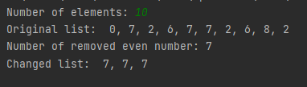
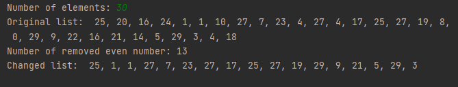

# Лабораторна 5
##Мета роботи
Вивчити основні підходи формалізації евристичних алгоритмів і вирішення типових задач з їх допомогою. 
##Завдання
Варіант 22: Створити список цілих чисел. Вилучити із списку усі парні числа, підрахувавши їх кількість. 
Надрукувати початковий, змінений список та визначену величину.
##Виконання
###Псевдокод алгоритму
```
procedure Length(list)
    current = list.head
    count = 0
    while current
    do 
        count = count + 1
        cur = cur.next
    return count

procedure GetItemByIndex(list, index)
    if index > Length(list)
    then error "List index out of range"
    
    current = list.head
    for i from 1 to index
    do current = current.next
    return current.data

procedure Push(list, data):
    node = Node(data)
    
    if Length(list) == 0
    then list.head = node
    else
        current = list.head
        while current.next
        do current = current.next
        current.next = node

procedure Pop(list, index):
    if index > Length(list)
    then error "List index out of range"
    
    if index == 0 
    then list.head = list.head.next
    else
        current = self.head
        for i from 1 to index - 1
            do current = current.next
        current.next = current.next.next

procedure DeleteEven(list)
    n = 0
    for i from Length(list) downto 1
    do 
        if list[i] mod 2 == 0
        then Pop(list, i)
        n = n + 1  
```
###Програмна реалізація алгоритму
####Вихідний код
```py
from random import choice
class Node:
    def __init__(self, data=0, next_node=None):
        self.data = data
        self.next = next_node


class MyList:
    def __init__(self, head=None):
        self.__head = head

    def __len__(self):
        cur = self.__head
        count = 0
        while cur:
            count += 1
            cur = cur.next
        return count

    def __getitem__(self, index):
        if index >= len(self):
            raise IndexError("list index out of range")
        cur = self.__head
        for _ in range(index):
            cur = cur.next
        return cur.data

    def __iter__(self):
        for i in range(len(self)):
            yield self[i]

    def __repr__(self):
        return ", ".join(str(x) for x in self)

    def push(self, data):
        """Push element into the tail of the list"""
        node = Node(data)
        if len(self) == 0:
            self.__head = node
        else:
            cur = self.__head
            while cur.next:
                cur = cur.next
            cur.next = node

    def pop(self, index):
        """Remove element with an index from a list"""
        if index > len(self):
            raise IndexError("list index out of range")
        if index == 0:
            self.__head = self.__head.next
        else:
            cur = self.__head
            for _ in range(index - 1):
                cur = cur.next
            cur.next = cur.next.next

def main():
    my_list = MyList()

    n = int(input("Number of elements: "))

    for _ in range(n):
        my_list.push(choice(range(n)))

    print("Original list: ", my_list)

    evens = 0
    for i in range(len(my_list)-1, -1, -1):
        if my_list[i] % 2 == 0:
            my_list.pop(i)
            evens += 1

    print(f"Number of removed even number: {evens}")

    print("Changed list: ", my_list)
```
####Приклад роботи




##Висновок
Під час виконання даної лабораторної роботи було розроблено однозв'язний лінійний список та алгоритми 
отримання його довжини, отримання елемента списку за індексом, додавання елемента в кінець списку, 
видалення елемента за індексом, на основі них було розроблено алгоритм видалення парних чисел із заданого списку з 
підрахунком цих чисел, було виконано програму реалізацію даних алгоритмів на Python та протестовано на різних 
випадкових списках.  