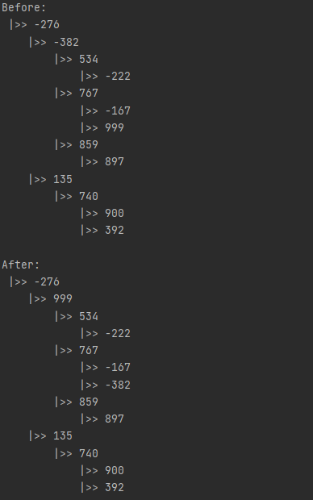
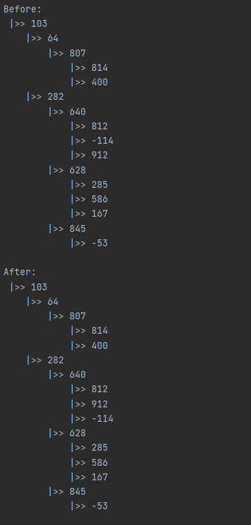

# Лабораторна 6

## Мета роботи

Вивчити основні підходи формалізації та імплементації алгоритмів побудови та обробки базових деревовидних структур.
## Завдання

Варіант 22: Побудувати дерево, елементами якого є дійсні числа. Поміняти місцями найбільше та найменше значення дерева.

## Виконання

### Псевдокод алгоритму

```
procedure Append(parentNode, childNode)
    parentNode.push(childNode)

procedure Traversal(node)
    results = []
    if node has value 
    then 
        results.push(node)
        for child in node.children
        do results = results + Traversal(child)
    return results

procedure SwapMaxMin(rootNode)
    nodes = Traversal(rootNode)
    min_node = nodes[0]
    max_node = nodes[0]
    
    for i from 2 to length(nodes)
    do 
        if nodes[i].value < min_node.value
        then min_node = nodes[i]
        
        if nodes[i].value > max_node.value
        then max_node = nodes[i]
    
    swap(max_node.value, min_node.value)  
```

### Програмна реалізація алгоритму

#### Вихідний код

```py
class Node:
    def __init__(self, value):
        self.value = value
        self.depth = 0
        self.children = []

    def append(self, node) -> None:
        node.depth = self.depth + 1
        self.children.append(node)

    def __repr__(self):
        s = '    '*self.depth + '|>> '
        s += str(self.value) + '\n'

        if self.children:
            for child in self.children:
                s += repr(child)
        return s

    def traversal(self, node) -> list:
        res = []

        if node:
            res.append(node)
            for child in node.children:
                res += self.traversal(child)

        return res

    def swap_max_min(self) -> None:
        nodes = self.traversal(self)
        min_node = max_node = nodes[0]
        for node in nodes[1:]:
            if node.value < min_node.value:
                min_node = node
            if node.value > max_node.value:
                max_node = node

        max_node.value, min_node.value = min_node.value, max_node.value
```

#### Приклад роботи





## Висновок

Під час виконання даної лабораторної роботи було розроблено загальне дерево та алгоритми додавання вершини у дерево, 
його обходу, обміну місцями  найбільшого та найменшого значення дерева, було виконано програмну реалізацію цієї 
структури даних на Python та протестовано на різних випадкових деревах.
